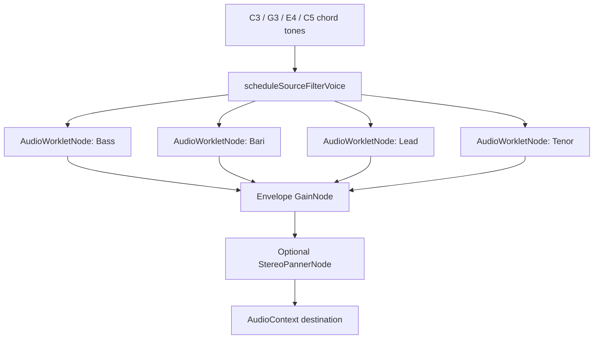
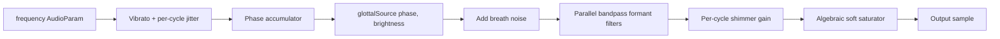

# Source-filter singer exploration research

## Executive Summary

The document at `web/docs/source-filter-singer.md` describes ChordPlay's most promising synthetic singing direction: a Web Audio `AudioWorklet` source-filter voice with a glottal excitation source, breath noise, a parallel formant filter bank, shimmer/jitter, and outer gain/pan staging.[^1] The current implementation is already wired into the C-chord research page as the `source-filter-singer` technique, but it uses one shared `Choir Blend` formant preset for all four voices and hard-coded constants for brightness, gain, shimmer, jitter, and vowel.[^2] The two biggest obstacles to the sound the doc wants are excessive vibrato from the reused `Choir Blend` preset and buzz/harshness from the sharp glottal closing shape plus high-band resonance and output drive.[^3]

The best next step is not a full rewrite. Start with named A/B technique variants that adjust existing knobs only, then add a small source-filter explorer panel/page once you know which directions are worth interactive control.[^4] The most promising listening sweeps are: locked vs subtle vibrato, low vs current brightness, lower output gain, lower shimmer, `Choir Blend` vs per-voice `VOICE_FORMANTS`, and a glottal closure-softening change.[^5]

## Query classification and assumptions

This is a **technical deep-dive** because the request is about exploring a documented synthesis architecture, its implementation, tweak points, and how to run sound-design experiments in the web app.[^6] I assume future work should target the React/TypeScript/Web Audio frontend rather than the older Haskell proof of concept, consistent with the repository instruction context.

## Key files and roles

| File | Role |
|---|---|
| `web/docs/source-filter-singer.md` | Seed design/tuning document; states the source-filter architecture, known issues, and future experiments.[^1] |
| `web/src/research/source-filter-voice-processor.js` | AudioWorklet DSP: glottal source, noise, formant filters, vibrato, jitter, shimmer, and soft saturation.[^7] |
| `web/src/research/c-chord-realism.ts` | Main-thread scheduler/registry for research techniques, including source-filter worklet construction and fallback.[^2] |
| `web/src/research/c-chord-realism.html` | Demo UI with technique cards and a static source-filter card.[^8] |
| `web/src/research/presets.ts` | Existing vocal presets such as `Choir Blend`, `Operatic`, `Dark / Covered`, `Breathy`, `Bright`, `Nasal`, and vowel presets.[^9] |
| `web/src/engine/formants.ts` | Shared formant model and per-voice barbershop `VOICE_FORMANTS` profiles.[^10] |
| `web/src/research/formantSynth.ts` | Older additive/formant synth path for comparison and reusable ideas.[^11] |

## Current source-filter architecture



Inside each worklet, the signal flow is:



The processor declares nine AudioParams: `frequency`, `gain`, `vibratoRate`, `vibratoDepth`, `breath`, `brightness`, `jitter`, `shimmer`, and `vowel`.[^12] The main thread schedules those parameters when each voice is created, and sends custom formants plus a deterministic per-voice random seed over the worklet message port.[^13] Custom formants override the built-in vowel table, which means the current `SOURCE_FILTER_VOWEL = 0` constant is effectively inactive while `Choir Blend` formants are posted by message.[^14]

The source-filter scheduler creates one mono `AudioWorkletNode` per chord voice, wraps it in an outer envelope `GainNode`, and optionally routes through a `StereoPannerNode` using the shared spatial config.[^15] The implementation has a graceful fallback: if `AudioWorklet` is unsupported or the module fails to load, the technique falls back to the older spatial formant-preset path using the same `Choir Blend` preset.[^16]

## Current sound-shaping settings

The source-filter technique currently uses `Choir Blend` as its formant/preset source, with `vibratoRate = 5.0`, `vibratoDepth = 0.008`, `breathMix = 0.03`, and five wide, low-projection formants at 700, 1150, 2500, 3350, and 4200 Hz.[^17] On top of the preset, the source-filter path hard-codes `SOURCE_FILTER_PARAM_GAIN = 0.58`, `SOURCE_FILTER_OUTPUT_GAIN = 0.34`, `SOURCE_FILTER_BRIGHTNESS = 0.52`, `SOURCE_FILTER_JITTER = 0.0025`, `SOURCE_FILTER_SHIMMER = 0.018`, and `SOURCE_FILTER_VOWEL = 0`.[^18]

The voice also uses per-voice spatial settings: Bass left with slightly higher gain and -1.5 cents detune, Bari left-center with +1.2 cents, Lead right-center with +0.7 cents, and Tenor right with -0.9 cents.[^19] Those offsets help the ensemble feel less synthetic, but they also add beating that can work against a locked barbershop-ring experiment if the goal is maximum overtone reinforcement.[^20]

## Why the current source-filter voice is promising

The worklet separates excitation from vocal-tract filtering, so it can explore timbre by changing source shape, noise, formant frequencies, bandwidths, and projection independently.[^7] That is more flexible than the older additive formant synth, which precomputes a harmonic amplitude profile from formant envelopes and then creates one oscillator per harmonic.[^11] The worklet is also a better fit for future expressive controls because `brightness`, `breath`, `jitter`, `shimmer`, and `vowel` already exist as AudioParams.[^12]

The `VOICE_FORMANTS` table is especially valuable because it already encodes per-part barbershop vowel differences and stronger Lead projection via boosted F3/F4 amplitudes.[^10] In contrast, the current source-filter technique sends the same `Choir Blend` formants to all four voices, which is likely smoother but less ring-focused.[^17]

## Main problems to address

### 1. Vibrato is too high for locked harmony

The source-filter path inherits `vibratoDepth = 0.008` from `Choir Blend`.[^17] The seed doc explicitly flags that as too much for barbershop and suggests much lower values such as 0.001-0.003 or zero for locked harmony.[^3] External barbershop context agrees that ringing chords depend on just tuning and no excessive vibrato, because vibrato smears reinforcing overtones.[^21]

### 2. Buzz/harshness is probably multi-factor

The processor's glottal model uses a positive half-sine opening phase followed by a negative closing phase with amplitude about `-1.15`, then returns to zero for the closed phase.[^22] The seed doc and implementation analysis identify this sharp closing segment as a likely buzz source.[^3] Literature on Rosenberg/Klatt/LF-style models points to a collision or return phase as the usual way to reduce abrupt closure artifacts.[^23]

Brightness also contributes: the coefficient update narrows bandwidth and boosts high-frequency formant gain as `brightness` rises.[^24] At the current brightness of 0.52, high-band formants are boosted rather than tamed, which can emphasize 2.5-4.2 kHz content.[^18] Finally, the parallel filter bank is summed and driven into an algebraic soft saturator, so high filter output can become audible distortion even without hard clipping.[^25]

### 3. The default formants are blend-oriented, not ring-oriented

`Choir Blend` deliberately widens bandwidths and reduces upper-formant amplitudes to avoid solo projection.[^17] For barbershop ring, the existing `VOICE_FORMANTS` profiles are more targeted: Bass/Bari/Lead/Tenor differ in F1/F2 and Lead has stronger F3/F4 projection.[^10] The `Operatic` preset is another useful contrast because it clusters upper formants around 2800, 3100, and 3400 Hz, similar to the singer's formant range described in singing literature.[^26]

## Recommended experiment plan

### Phase 1: Add named A/B variants with no processor changes

This is the lowest-risk path: create several new technique cards or internal variants that call the same source-filter scheduler with different option values.[^4] It avoids live worklet control complexity and lets you quickly listen for which direction is worth deeper implementation.

| Variant | Purpose | Preset/formants | Suggested values |
|---|---|---|---|
| Current baseline | Preserve current reference | `Choir Blend` | current constants |
| Locked barbershop | Test maximum chord lock | `VOICE_FORMANTS[tone.voice]` | vibrato 0, brightness 0.40, outputGain 0.26, shimmer 0.010, jitter 0.001 |
| Subtle human | Natural but mostly locked | `Choir Blend` or `VOICE_FORMANTS` | vibratoDepth 0.0015-0.003, vibratoRate 5.0, brightness 0.42-0.45 |
| Smooth choir | Reduce buzz and projection | `Choir Blend` | vibratoDepth 0.003, breath 0.04, brightness 0.35-0.40, outputGain 0.26 |
| Singer's-formant ring | Test upper-formant projection | `Operatic` or Lead-like `VOICE_FORMANTS` | vibrato 0-0.002, brightness 0.40-0.50, lower gain to avoid harshness |
| Warm covered | Darker vowel/color | `Dark / Covered` | brightness 0.30-0.38, breath 0.02, shimmer 0.008-0.012 |
| Breathy extreme | Confirm breath control boundaries | `Breathy` | breath reduced from preset if fizzy, brightness 0.35-0.45 |
| Nasal extreme | Deliberate contrast | `Nasal` | low output gain, use only for A/B contrast |

Implementation-wise, Option A from the UI research is enough: add new IDs to `TECHNIQUE_IDS`, add entries in `TECHNIQUES`, and add corresponding cards in `c-chord-realism.html`.[^4]

### Phase 2: Run targeted parameter sweeps

Run sweeps in this order so each test isolates one perceptual dimension.

1. **Debuzz sweep:** outputGain 0.24/0.26/0.28/0.34, brightness 0.35/0.40/0.45/0.52, shimmer 0.008/0.010/0.015/0.018.[^5]
2. **Vibrato sweep:** vibratoDepth 0/0.0015/0.003/0.008 at vibratoRate 5.0, plus a no-vibrato locked reference.[^3]
3. **Formant sweep:** `Choir Blend`, `VOICE_FORMANTS` per voice, `Operatic`, `Dark / Covered`, `Bright`, and `Nasal`.[^9]
4. **Source-shape sweep:** current glottal closure, lower closing amplitude such as -0.8 to -0.9, and an exponential return/collision tail.[^23]
5. **Breath sweep:** breath 0.005/0.015/0.03/0.06, and later try glottal-phase-gated breath rather than constant white noise.[^27]
6. **Stereo/lock sweep:** current per-voice detune/onset/pan vs centered/no-detune to hear whether the spatial humanization reduces ring.[^19]

### Phase 3: Add an explorer UI only after the best variant families are known

The existing realism page is a grid of technique cards and a status panel; the source-filter card has no sliders.[^8] The adjacent `ah-sound` research page already provides a dark-theme slider-row pattern for live synthesis parameters.[^28] A source-filter explorer should reuse that style, but it should probably be a separate page or collapsible panel to avoid overwhelming the existing nine-card comparison page.[^4]

A practical first interactive panel would expose: preset/formant source, brightness, vibratoDepth, vibratoRate, breath, shimmer, jitter, outputGain, and maybe a locked/spatial toggle. Live-updating currently playing worklet nodes requires storing references to active source-filter `AudioWorkletNode`s, because the existing active-node registry is designed for stop/disconnect rather than parameter editing.[^29] For that reason, a replay-based explorer is simpler than true live tweaking: adjust sliders, click replay, compare.

## Processor changes worth trying

### Soften glottal closure

The highest-value DSP change is adding a closure/return tail to avoid a hard transition to zero.[^23] This maps directly to Klatt's collision phase or LF-style return phase and should reduce buzz without needing to darken the whole sound.[^23]

A minimal conceptual change is:

```js
// Concept only: tune against the existing glottalSource() implementation.
if (phase < closingEnd) {
  const x = (phase - openingEnd) / (closingEnd - openingEnd);
  return -0.85 * Math.sin(PI_OVER_TWO * x);
}
const tail = -0.2 * Math.exp(-(phase - closingEnd) / closureTau);
return Math.abs(tail) < 0.001 ? 0 : tail;
```

Start with `closureTau` around 0.02-0.05 cycles and lower the closing amplitude from -1.15 toward -0.8 or -0.9.[^23]

### Add spectral tilt or reduce pre-saturation drive

The worklet currently applies a fixed `0.55` scale before the algebraic saturator.[^25] If the parallel formant sum is driving saturation, lowering that scale to roughly 0.28-0.35 should reduce buzz without losing the source-filter character.[^25] A separate spectral-tilt parameter would be more expressive: glottal derivative models normally need source rolloff independent of formant placement, and Klatt-style synthesis treats spectral tilt as its own source parameter.[^23]

### Use formant normalization cautiously

The RBJ bandpass coefficient form used by the processor is a standard constant-peak-gain bandpass topology.[^30] However, parallel resonator gain and perceived loudness still vary with center frequency, bandwidth, and summed formants.[^31] If adding louder/narrower upper formants for ring, lower output gain or normalize formant gain sums before judging the tone.

### Smooth UI-driven k-rate parameters

AudioWorklet render quanta are 128 frames, and k-rate parameters are constant for each render block.[^32] If sliders are added for brightness, breath, shimmer, or vowel, update them with `setTargetAtTime` or ramps rather than abrupt `setValueAtTime` jumps to avoid zipper noise.[^33]

## Presets and formant assets to prioritize

| Asset | Why it matters |
|---|---|
| `Choir Blend` | Current baseline; wide bandwidths and reduced F3/F4 amplitudes make it smoother and less projective.[^17] |
| `VOICE_FORMANTS` | Best built-in barbershop source: per-voice [ae]-like profiles and Lead projection boost.[^10] |
| `Operatic` | Strong singer's-formant contrast with F3/F4/F5 around 2800/3100/3400 Hz.[^26] |
| `Dark / Covered` | Dark/warm contrast with steep tilt and reduced high formants.[^9] |
| `Bright` | Upper bound for high-formant projection.[^9] |
| `Breathy` | Extreme breath source for checking noise character, though its breathMix is likely too high for a clean quartet.[^9] |
| `Nasal` | Narrow-bandwidth contrast; useful for proving the experiment harness can reveal bad resonances.[^9] |

## Existing older synthesis paths: what to reuse

The older `FormantSynth` and scheduled formant voices generate sine oscillators for harmonics computed from `computeHarmonicsFromProfile`, then add vibrato, breath noise, and amplitude jitter using Web Audio nodes.[^11] That path is less physically flexible than the worklet source-filter model, but it has reusable ideas: proportional vibrato per harmonic, formant-shaped breath noise, RMS normalization, and a clean preset system.[^11]

The production audio engine also applies low-harmonic floors and a high shelf to warm the barbershop formant sound.[^34] That could inspire a source-filter macro for warmth, but it should not be copied blindly because the worklet has a different excitation source and parallel filters.[^34]

## Implementation roadmap

1. **Create a configurable source-filter scheduler.** Replace module-level source-filter constants in `scheduleSourceFilterVoice` with a `SourceFilterOptions` object while preserving the current constants as the default.[^18]
2. **Add 4-6 named variants.** Register them through `TECHNIQUE_IDS` and `TECHNIQUES`, and add HTML cards or a grouped `<details>` section.[^4]
3. **Include parameter values in status output.** The existing status output is the natural place to show active variant settings, making listening notes easier.[^8]
4. **Add per-voice formant mode.** For a barbershop variant, send `VOICE_FORMANTS[tone.voice]` instead of the shared preset formants.[^10]
5. **Run the debuzz and vibrato sweeps before changing glottal code.** If lower brightness/gain/shimmer and vibrato solve most issues, defer processor changes.[^5]
6. **If buzz remains, add closure softening.** Implement a closure/tail parameter or hard-code a gentler return phase as an experiment.[^23]
7. **Move to a separate explorer page if variant count grows.** The Vite config already treats `c-chord-realism` as a multi-page app entry, so a `source-filter-explorer.html` entry is a clean zero-regression path.[^35]

## Validation suggestions

Run the web test/build commands from `web/` after code changes: `npm test` and `npm run build`.[^36] Manually test the research page in a browser because the source-filter worklet path depends on real Web Audio APIs and has no dedicated automated tests.[^37] For listening, keep a short note grid with variant name, parameters, speaker/headphone device, perceived buzz, warmth, ring, blend, and whether the chord locks.

## Confidence Assessment

High confidence: file roles, current parameter values, current source-filter signal flow, AudioParam inventory, preset values, and integration points are directly supported by local file citations from the delegated repository research.[^1][^2][^7][^9][^10][^12][^18]

Medium confidence: perceptual labels such as warmth, buzz, blend, and ring are supported by the code structure plus external DSP/singing references, but they remain subjective and playback-device dependent.[^21][^23][^26][^31]

Lower confidence: exact best numeric values for `closureTau`, saturation scale, and future tilt parameters require listening tests. External glottal-source literature is mostly speech-oriented, and the literature subagent noted that speech thresholds should not be over-applied to sustained singing synthesis.[^38]

## Footnotes

[^1]: `web/docs/source-filter-singer.md:41-60`, `web/docs/source-filter-singer.md:232-248`.
[^2]: `web/src/research/c-chord-realism.ts:835-898`, `web/src/research/c-chord-realism.ts:900-970`, `web/src/research/c-chord-realism.ts:1100-1140`.
[^3]: `web/docs/source-filter-singer.md:148-194`.
[^4]: `web/src/research/c-chord-realism.ts:10-20`, `web/src/research/c-chord-realism.ts:1100-1140`, `web/src/research/c-chord-realism.html:119-191`.
[^5]: `web/docs/source-filter-singer.md:156-194`, `web/src/research/c-chord-realism.ts:99-104`.
[^6]: Research classification based on the user request for exploring implementation/tweaks around `web/docs/source-filter-singer.md`.
[^7]: `web/src/research/source-filter-voice-processor.js:294-381`.
[^8]: `web/src/research/c-chord-realism.html:56`, `web/src/research/c-chord-realism.html:168-175`, `web/src/research/c-chord-realism.html:192-203`.
[^9]: `web/src/research/presets.ts:13-302`.
[^10]: `web/src/engine/formants.ts:3-7`, `web/src/engine/formants.ts:15-44`.
[^11]: `web/src/research/formantSynth.ts:157-256`, `web/src/research/c-chord-realism.ts:585-692`.
[^12]: `web/src/research/source-filter-voice-processor.js:58-124`.
[^13]: `web/src/research/c-chord-realism.ts:863-883`.
[^14]: `web/src/research/source-filter-voice-processor.js:153-184`, `web/src/research/source-filter-voice-processor.js:311-321`.
[^15]: `web/src/research/c-chord-realism.ts:847-898`.
[^16]: `web/src/research/c-chord-realism.ts:350-375`, `web/src/research/c-chord-realism.ts:948-966`.
[^17]: `web/src/research/presets.ts:188-203`, `web/src/research/c-chord-realism.ts:914`.
[^18]: `web/src/research/c-chord-realism.ts:96-104`, `web/src/research/c-chord-realism.ts:863-876`.
[^19]: `web/src/research/c-chord-realism.ts:126-131`.
[^20]: `web/src/research/c-chord-realism.ts:126-131`; Barbershop ring context from https://en.wikipedia.org/wiki/Barbershop_music.
[^21]: Wikipedia, "Barbershop music", ringing chord discussion: https://en.wikipedia.org/wiki/Barbershop_music.
[^22]: `web/src/research/source-filter-voice-processor.js:276-292`.
[^23]: Praat Rosenberg reference: https://www.fon.hum.uva.nl/praat/manual/Rosenberg__1971_.html; Praat phonation/Rosenberg model: https://www.fon.hum.uva.nl/praat/manual/PointProcess__To_Sound__phonation____.html; Praat KlattGrid source parameters: https://www.fon.hum.uva.nl/praat/manual/KlattGrid.html.
[^24]: `web/src/research/source-filter-voice-processor.js:234-262`.
[^25]: `web/src/research/source-filter-voice-processor.js:323-378`; algebraic saturator discussion from delegated literature research and RBJ/JOS context.
[^26]: `web/src/research/presets.ts:172-187`; singer's formant range context from Wikipedia, "Formant": https://en.wikipedia.org/wiki/Formant.
[^27]: `web/src/research/source-filter-voice-processor.js:323-356`; Praat KlattGrid breathiness/source parameters: https://www.fon.hum.uva.nl/praat/manual/KlattGrid.html.
[^28]: `web/src/research/ah-sound.html:62-77`, `web/src/research/ah-sound.ts:37-57`.
[^29]: `web/src/research/c-chord-realism.ts:234-283`, `web/src/research/c-chord-realism.ts:835-898`.
[^30]: `web/src/research/source-filter-voice-processor.js:234-262`; RBJ Audio EQ Cookbook bandpass coefficients: https://www.musicdsp.org/en/latest/_downloads/3e1dc886e7849251d6747b194d482272/Audio-EQ-Cookbook.txt.
[^31]: JOS CCRMA resonator bandwidth/pole relation: https://ccrma.stanford.edu/~jos/fp/Resonator_Bandwidth_Terms_Pole.html; time-varying two-pole filter warning: https://ccrma.stanford.edu/~jos/fp/Time_Varying_Two_Pole_Filters.html.
[^32]: Chrome Developers, "Audio Worklet": https://developer.chrome.com/blog/audio-worklet.
[^33]: Web Audio API automation methods: https://webaudio.github.io/web-audio-api/.
[^34]: `web/src/engine/audio.ts:39-86`, `web/src/engine/audio.ts:111-123`.
[^35]: `web/vite.config.ts:11-16`.
[^36]: `web/package.json:6-12`.
[^37]: `web/src/engine/formants.test.ts:1-140`; no dedicated source-filter/worklet tests were found by the delegated research.
[^38]: Delegated literature research noted speech-vs-singing caution from Praat/Klatt/LF source-model context and clinical jitter/shimmer cautions: https://www.fon.hum.uva.nl/praat/manual/Voice_2__Jitter.html, https://www.fon.hum.uva.nl/praat/manual/Voice_3__Shimmer.html.
